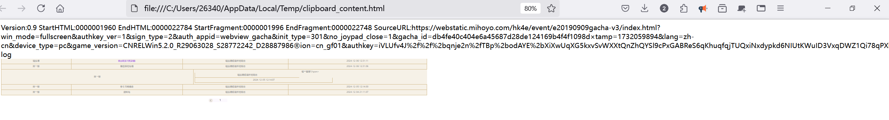

> 每次写这类科普文章的时候都写不下去，因为在每次动笔之前的查资料阶段总会忽然遇到一大堆我想要进一步了解而不能迅速明了的问题。但考虑到或许写出来会对大家有所帮助，所以还是硬着头皮写了，如果发现文中有任何错漏欢迎各位指正。  

# 起因
随着原神及之后一系列游戏的风靡，出现了各类抽卡分析的小程序、软件。而它们如何用一直是老生常谈的问题：不断有软件等失效，也不断有新朋友入坑，导致一直有人琢磨不透这东西到底是怎么用的。  
我在此总结和介绍一下他们的原理和用法，希望对读者有所帮助。
# 看之前你或许需要了解的概念
URL：统一资源定位符，本文中可以理解为网站的网址链接，但它的作用不止于此。
webviewer：安卓自带的网页查看器，本文中理解为浏览器即可。
qqbot：用于qq的机器人。
PC：个人电脑，就是你的电脑。
powershell：Windows系统提供的脚本环境，类似于cmd，可以通过命令行来在各种方面控制电脑完成各种任务。
# 如何进行抽卡分析？
我们知道游戏中提供了抽卡的历史记录功能，可以供我们查看6-12个月不等的时间内的详细抽卡记录。  
从思路上来讲，我们只需要把这些数据抄出来就能进行各种计算和分析了。但手抄显然是一种低效又没意义的做法，因为这个显示抽卡历史的页面是一个内嵌的网页，我们能够很自然地想到通过获得这个网站的网址来直接获得这些记录，这也是现如今大部分小程序都会通过一个链接来取得你的抽卡记录的原因吧。  
老玩家或许还记得，在游戏刚开服的一年多，这个链接是容易获得的：只需要在手机上打开抽卡页面，关掉手机的网络再点击打开抽卡记录，webviewer就会因为没有网络、打不开网页而直接把网址显示出来。  
虽然现在这样做已经不行了，但总体来说思路还是一样的：想办法获得这个链接，然后通过链接返回的内容进行分析即可。这种方案总体上来说就是你把抽卡记录掏出来给了小程序来分析。  
有没有其他的方案呢，确实是有的，就例如小黑盒、一众qqbot等。除了链接之外，它们有时还需要你手动登录米哈游通行证/米游社扫描二维码等，这就是另一种也好理解的思路：你把你的米哈游账户给了这些程序，它们当然可以自己把你的抽卡记录掏出来分析。但正如你所担忧的，这种方案有隐性的风险：你在这些软件/程序上登陆了你的账户，就等于把你的账户会话给了它们，它们是可以不经你的允许就对你的账户进行一些你不知道的操作的。小黑盒规模足够大，我们相信它不会做什么坏事，但如过我个人现在发布一款“小五颜六色盒”的抽卡分析软件、使用后者的方式来获取你的抽卡信息，你就应该避免使用来规避风险。  
# 具体如何获得数据？
说了这么多，总结来说就是两种方案：  
1. 我自己获得抽卡链接，把链接提供给程序。  
2. 我把账号给程序，程序帮我完成所有操作。

在此我们只讨论第一种方案。第二种因为操作比较简单，只需要验证码登录/扫码即可；并且我个人并不推荐，因此不做讨论。 
要获得这个链接，我们要根据设备不同选择不同方案。 
## 对于PC
获取链接的方法大同小异，[非小酋](feixiaoqiu.com)为原神的国服抽卡链接获取提供了两种方案，分别是使用它提供的脚本和在剪切板里提取：
  
### 方法一：使用脚本
先打开原神游戏，打开抽卡记录页之后按Win+R,输入powershell并回车，然后在打开的powershell窗口中运行以下命令：
```powershell
iex "&{$(irm https://tt.xianx.com.cn/link/ys/l.ps1)} china"
```
脚本会自动把你想要的链接输出并放进你的剪切板，你可以直接粘贴出来。如此一来，把这个链接粘贴到任意抽卡分析程序里就可以了，比如非小酋。    
  
### 方法二：在剪切板中提取
非小酋还提供了另一种有趣的方案，先按Win+R,输入powershell并回车，然后在打开的powershell窗口中运行以下命令：
```powershell
pause;$m=(((Get-Clipboard -TextFormatType Html) | sls "(https:/.+log)").Matches[0].Value);$m;Set-Clipboard -Value $m
```
此时powershell会提示“按Enter继续”，我们不要按enter,打开游戏并打开抽卡记录页面，直接选中所有的抽卡记录，按Ctrl+C复制并Ctrl+V粘贴进powershell里：

然后powershell就会把链接放进你的剪切板，和刚刚一样你可以直接粘贴出来。如此一来，把这个链接粘贴到任意抽卡分析程序里就可以了，比如非小酋。  
### 安全吗？
> 对这个话题不感兴趣的朋友可以不看，右边可以跳转。  

可能有的网友有疑虑：方法一给出的命令看起来非常像Steam假入库用到的命令（图源网络）：
  
确实，这两个操作的本质是类似的，都是下载一个ps1脚本文件并运行。我们来分析一下异同：
```powershell
iex "&{$(irm https://tt.xianx.com.cn/link/ys/l.ps1)} china"
```
这是用`irm`(`Invoke-RestMethod`)下载
`https://tt.xianx.com.cn/link/ys/l.ps1`的内容作为一个字符串，然后`iex`(`Invoke-Expression`)把它当成powershell代码，然后加上参数`china`来运行它。
而另一个假入库的命令：
```powershell
irm ███████████.run|iex
```
也是同理，通过`irm`下载某个网址的ps1文件，然后通过管道符`|`传递给`iex`来运行。  
由此可见，关键问题就在于这个网址给出的程序是善是恶了。  
我们可以通过`irm`来下载这个脚本并不运行它来检查，比如在powershell里运行这个：
```powershell
irm https://tt.xianx.com.cn/link/ys/l.ps1
```
他就会打印出这个用来获得原神抽卡链接的脚本到底干了些啥：
```powershell
$logLocation = "%userprofile%\AppData\LocalLow\miHoYo\Genshin Impact\output_log.txt";
$logLocationChina = "%userprofile%\AppData\LocalLow\miHoYo\$([char]0x539f)$([char]0x795e)\output_log.txt";

$reg = $args[0]
$apiHost = "public-operation-hk4e-sg.hoyoverse.com"
if ($reg -eq "china") {
  Write-Host "Using China cache location"
  $logLocation = $logLocationChina
  $apiHost = "public-operation-hk4e.mihoyo.com"
}

$tmps = $env:TEMP + '\pm.ps1';
if ([System.IO.File]::Exists($tmps)) {
  ri $tmps
}

$path = [System.Environment]::ExpandEnvironmentVariables($logLocation);
if (-Not [System.IO.File]::Exists($path)) {
    Write-Host "Cannot find the log file! Make sure to open the wish history first!" -ForegroundColor Red

    if (-NOT ([Security.Principal.WindowsPrincipal][Security.Principal.WindowsIdentity]::GetCurrent()).IsInRole([Security.Principal.WindowsBuiltInRole] "Administrator")) {
        Write-Host "Do you want to try to run the script as Administrator? Press [ENTER] to continue, or any key to cancel."
        $keyInput = [Console]::ReadKey($true).Key
        if ($keyInput -ne "13") {
            return
        }

        $myinvocation.mycommand.definition > $tmps

        Start-Process powershell -Verb runAs -ArgumentList "-noexit", $tmps, $reg
        break
    }

    return
}

$logs = Get-Content -Path $path
$m = $logs -match "(?m).:/.+(GenshinImpact_Data|YuanShen_Data)"
$m[0] -match "(.:/.+(GenshinImpact_Data|YuanShen_Data))" >$null

if ($matches.Length -eq 0) {
    Write-Host "Cannot find the wish history url! Make sure to open the wish history first!" -ForegroundColor Red
    return
}

$gamedir = $matches[1]
# Thanks to @jogerj for getting the latest webchache dir
$webcachePath = Resolve-Path "$gamedir/webCaches"
$cacheVerPath = Get-Item (Get-ChildItem -Path $webcachePath | Sort-Object LastWriteTime -Descending | Select-Object -First 1).FullName
$cachefile = Resolve-Path "$cacheVerPath/Cache/Cache_Data/data_2"
$tmpfile = "$env:TEMP/ch_data_2"

Copy-Item $cachefile -Destination $tmpfile

function testUrl($url) {
  $ProgressPreference = 'SilentlyContinue'
  $uri = [System.UriBuilder]::New($url)
  $uri.Path = "gacha_info/api/getGachaLog"
  $uri.Host = $apiHost
  $uri.Fragment = ""
  $params = [System.Web.HttpUtility]::ParseQueryString($uri.Query)
  $params.Set("lang", "en");
  $params.Set("gacha_type", 301);
  $params.Set("size", "5");
  $params.Add("lang", "en-us");
  $uri.Query = $params.ToString()
  $apiUrl = $uri.Uri.AbsoluteUri

  $response = Invoke-WebRequest -Uri $apiUrl -ContentType "application/json" -UseBasicParsing -TimeoutSec 10 | ConvertFrom-Json
  $testResult = $response.retcode -eq 0
  return $testResult
}

$content = Get-Content -Encoding UTF8 -Raw $tmpfile
$splitted = $content -split "1/0/"
$found = $splitted -match "webview_gacha"
$link = $false
$linkFound = $false
for ($i = $found.Length - 1; $i -ge 0; $i -= 1) {
  $t = $found[$i] -match "(https.+?game_biz=)"
  $link = $matches[0]
  Write-Host "`rChecking Link $i" -NoNewline
  $testResult = testUrl $link
  if ($testResult -eq $true) {
    $linkFound = $true
    break
  }
  Sleep 1
}

Remove-Item $tmpfile

Write-Host ""

if (-Not $linkFound) {
  Write-Host "Cannot find the wish history url! Make sure to open the wish history first!" -ForegroundColor Red
  return
}

$wishHistoryUrl = $link

Write-Host $wishHistoryUrl
Set-Clipboard -Value $wishHistoryUrl
Write-Host "$([char]0x62bd)$([char]0x5361)$([char]0x94fe)$([char]0x63a5)$([char]0x5df2)$([char]0x590d)$([char]0x5236)$([char]0x5230)$([char]0x526a)$([char]0x8d34)$([char]0x677f)" -ForegroundColor Green
```
总结来说，这个程序打开了原神的`log`日志，然后找到了缓存文件，最终从缓存文件中提取出了抽卡链接，并没有异常操作，是安全的。  
而那个假入库的我也`irm`了一下，但那个网址现在似乎已经不用了，已经被设置显性重定向到steam商店官网去了，所以把网址涂抹掉了，建议大家也不要尝试。总而言之，遇到`iex`的情况都应该留心，可以把链接发给懂的人检查一下。  
第二种方案很有趣，先来看命令：
```powershell
pause;$m=(((Get-Clipboard -TextFormatType Html) | sls "(https:/.+log)").Matches[0].Value);$m;Set-Clipboard -Value $m
```
这个命令先运行`pause`暂停住powershell，等待下一步输入。我们复制了抽卡信息给它之后它会通过`https:/`特征来提取出来抽卡链接并且塞回剪切板。  
但是我们复制出的抽卡记录直接粘贴只是一些简单的文本信息，哪里来的链接呢？比如我复制出来是这样的：
```
欧洛伦 (四星)
角色活动祈愿
2024-12-06 12:31:11
武器
黎明神剑
角色活动祈愿
2024-12-06 12:31:06
武器
鸦羽弓
角色活动祈愿
2024-12-05 12:14:07
武器
翡玉法球
角色活动祈愿
2024-12-05 12:14:00
武器
冷刃
角色活动祈愿
2024-12-04 21:11:07
1
```
实际上，这看似纯文本的信息里包含了不少元数据，我们可以通过这样的方案看到：先复制抽卡记录，然后用powershell运行
```powershell
Get-Clipboard -TextFormatType Html | Out-File -FilePath "$env:TEMP\clipboard_content.html"
```
这会把我们的剪切板里的内容以html的形式保存成一个html文件。我们再打开这个文件：
```powershell
Start-Process "$env:TEMP\clipboard_content.html"
```
就可以看到剪切板里实际的内容了,这其中就包括了我们需要的链接：
  
这个方案只是对剪切板内容进行了提取和字符处理，是安全的。
## 对于IOS设备
移动设备并不方便直接进行复制或是访问游戏的日志。从思路上来讲，既然抽卡记录只是个网页，我们可以通过抓包的方式获得它。  
对于IOS设备，抓包是容易的。不论是iPhone还是iPad等，都可以在AppStore获得抓包软件Stream:
  
先打开游戏切换到抽卡记录页，然后打开Stream,点击Sniff Now来开始抓包，回到游戏并切换一页抽卡记录，再回到Stream按Stop,然后去Histroy里寻找,这种长得特别长的就是了。

把它复制出来即可。
## 对于Android设备
Android设备抓包是非常繁琐的：经过不断的版本更新，安卓系统的安全特性不断增强。目前来说通常需要root权限把抓包软件的中间人证书升级为系统证书，或是使用magisk模块来让软件信任抓包软件的中间人证书等，即便能做到，步骤也很复杂，因此并不推荐使用这样的方法来获得抽卡链接。  
但合理配置后通过抓包的方式是可以和IOS设备一样获得所需要的抽卡链接的，图中第六行就是我们需要的链接。  

那安卓设备如何获得抽卡链接呢？绝大多数程序和软件都推荐安卓设备玩家使用PC来获得抽卡链接，我也推荐，这样确实比较方便。 
但如果实在没有条件，也可以尝试一下这一个开源的软件[Ascent](https://github.com/4o3F/Ascent/), 坏消息是它的使用条件也很复杂，过程也很繁琐，最重要的是他甚至不能覆盖全部的设备，但在各位使用直接短信验证/扫码登陆获取记录的软件前我还是建议尝试一下它。
### 使用Ascent
要使用这个软件，首先要求你的手机支持无线调试，也就是至少你的系统版本应该大于Android 11。但这只是使用这个软件的必要条件：除此之外很大部分手机也不在软件的支持范围内，比如华为运行鸿蒙系统的手机。  
从这里选择自己的架构并下载：https://github.com/4o3F/Ascent/releases/   
一般来说手机选择`armeabi-v7a`就可以，模拟器选择`x86_64`,如果拿不准也可以选择下载那个什么后缀都不带的通用版本。  
因为不同的手机差异很大，这里只给出通用办法，对于自己的设备可以加上型号去进一步搜索详细教程。  
要使用它首先有一个准备过程，它的原理类似于`Shizuku`,软件会作为adb平台通过无线调试来连接到手机本身：  
安装软件并打开手机的开发者选项，然后点击软件中的配对按钮，点击开始配对，软件应该会自动跳转到开发者选项中。现在找到无线调试选项并进入，开启后点击使用配对码配对设备，看到弹出的配对码后不要关闭它，直接下拉状态栏，点击Ascent的通知，此时应该可以看到输入的按钮，输入刚刚的配对码就配对成功了，准备工作就结束了。    
  
要使用他只需要点击主页的连接，点击开始连接，然后打开游戏，打开抽卡历史的页面，现在下拉状态栏就可以看到Ascent已经获取了抽卡链接，可以直接复制了。  


### 安全吗？
一般来说抓包过程不会运行什么未知的程序，Ascent也是开源软件，可以认为是安全的，唯一的风险可能就是信息泄露的风险了，因为本身经过tls加密的数据并不应该被中间人解密，但一般来说使用可信的软件也不用担心它。  

# 关于绝区零
绝区零修改了抽卡记录页面，它的链接是每一页都不一样的，也就是获取一次链接只能看到5条历史记录。  


本文暂未完成，还会持续更新。
