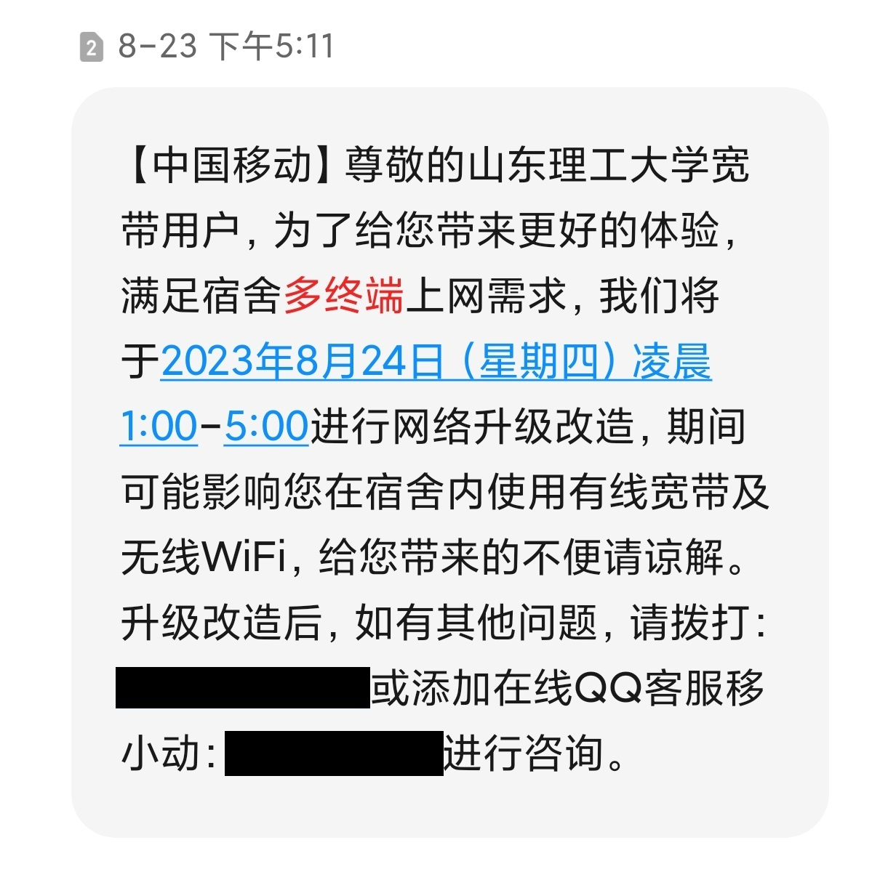
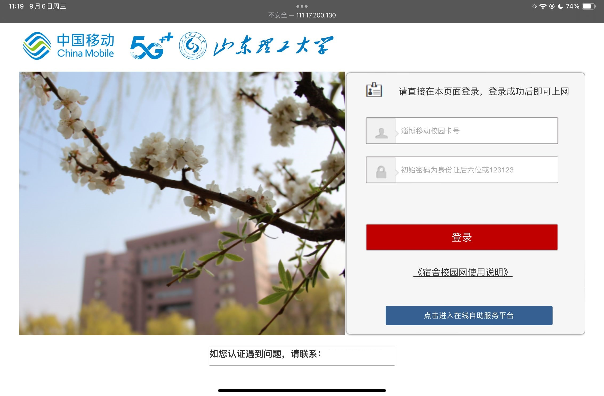
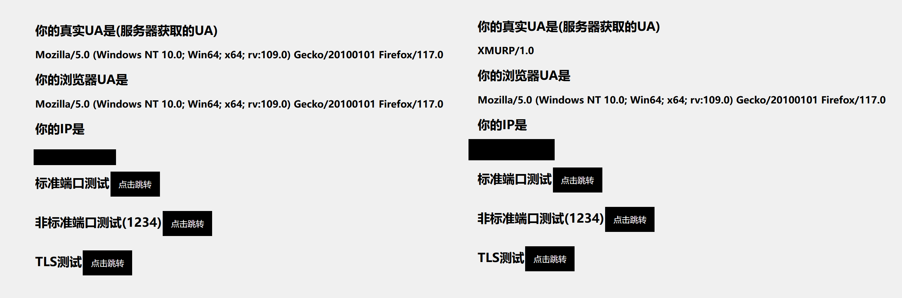
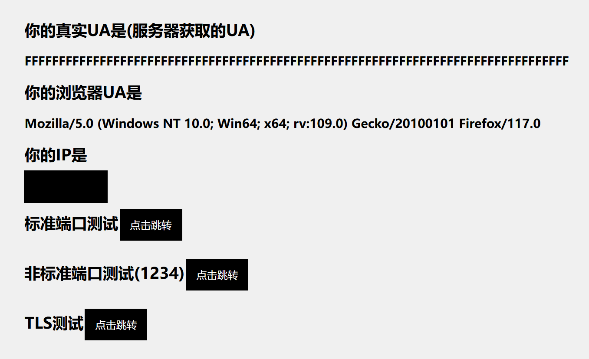

> 本文仅作经验分享用，不建议读者将之视为教程学习。除此之外，本文将保持更新。  
> 感谢 Zxilly、miao1007、CHN-Beta 等插件作者，IYATT-yx、SunBK201 等教程作者以及其他所有为相关项目做出贡献的前辈和朋友。
# 相关背景
本人就读于山东理工大学，学校仅提供中国移动一家运营商的校园网服务。所提供校园网包括无线网络和宽带，本文在此仅讨论宽带相关。  
我先后在两间宿舍居住，两间宿舍提供的网络环境硬件条件基本一致，其中一间是一个四口的网线墙插(但是只有一个能用)，另一间是一根光纤+一个光猫。  
而软件方面在 2023-8-24 经历过一次升级改造，在此之前使用 NetKeeper 软件进行认证登录，在此之后更换为了 Drcom 的 portal 方式认证。本文将完整记录两段时间的摸索和折腾经历。  
# 改造之前
## 入学之初
在我初入学时被学长半忽悠半强制着办理了中国移动校园电话卡(下称“电话卡”)，在这之后我发现宿舍区并没有由学校运维的校园网，只有接入了学校内网的移动运营的宽带/无线网服务。而刚提到电话卡有提供免费的宽带/无线校园网服务。  
> 也因此我认为我校学生办理移动的电话卡是有必要的。  

开通相关服务后发现宽带认证软件 NetKeeper 软件仅支持 Windows 系统安装，且这款软件内置有网络相关驱动，会直接屏蔽掉系统的网络共享功能。使用软件[ NoWifi ](https://apps.microsoft.com/store/detail/nowifi/9NK0DST7HZX5?hl=en-us&gl=us)开启热点后可以给其他设备使用，但过大概半小时左右 NetKeeper 就会断开，并且再次登录时返回调制解调器错误，在几小时后恢复。我倾向于认为是检测到分享网络的行为后登录被注销。  

但打开手机的无线功能却可以看到不少以“装路由器加我xxxx”为 SSID 的无线网。简单询问后发现他们有特殊的方式在路由器进行拨号，而这样的路由器有着非常高的溢价。一台普通的 K2 路由器往往只需要二三十元，而他们却一度卖到一百以上甚至几百元，还给不同的型号冠以“高级版”、“电竞版”等的名号，实际使用的却都是性能不高的过时型号。虽然交涉出的价格十分不友好，但我知道了他们使用了 K2 路由器安装 OpenWRT 系统和相关插件实现拨号，随即我便在淘宝下单了一台二手 K2 路由器。

## 安装OpenWRT
我所购买的 K2 路由器是原厂固件，按照经验思路寻找刷入 Breed 教程时却发现这台机器有着非常多的硬件版本，基本包括`PSG1218 A1`、`PSG1218 A2`、`PSG1218 A6`三个版本，而他们统一使用`PSG1208`的 Breed 。同时他们能够利用的漏洞不尽相同，不同的系统版本也有不同的漏洞可用。在那时，有的高版本系统只能拆机使用 ttl 或者编程器的方式写入 flash 芯片。而我买到的版本很幸运可以不拆机，通过用F12直接修改后台计划任务进行注入开启相关权限来刷入。经过一下午的折腾算是刷入了原版的 OpenWRT。
>目前(2023-9) K2 和 K2P 全系列不调系统版本都可以不拆机刷入 breed ,我曾看到有人在酷安平台做了展示，但目前我经找不到了，可以去相关平台发帖询问。

## 寻找相关拨号方案
我直接在 GitHub 搜索 NetKeeper 就看到了[这个 repo](https://github.com/miao1007/Openwrt-NetKeeper)。在此可以了解到这个软件的认证方式仍然是 PPPoE ，但在用户名前加入了一些特殊算法得出的字符。  
但这个 repo 提供的方案针对 NetKeeper 的较老版本，现在已经失效。它所使用的是通过逆向 NetKeeper 得到相关加密算法，然后通过 sxplugin.so 完成用户名计算，通过路由器拨号登陆的。  
新版的 NetKeeper 中已经更换了加密算法，并且把软件也做了加密，因此难以进行逆向。[这里](https://github.com/miao1007/Openwrt-NetKeeper/blob/master/netkeeper4-use-pppoer-server/README.md)则是提供了另一种方案，通过路由器拦截软件发出的 PPPoE 拨号请求，然后进行拨号。作者在 readme 中详细写了教程，于是我按照教程，在不少朋友的协助下和多次尝试后顺利地使用路由器拨号成功了。

## 关于相关检测措施
前文提到我使用 NetKeeper 登陆后，开启 NoWifi 共享网络会被上游服务器注销一段时间，在简单的摸索之后我认为这项检测存在于 NetKeeper 软件本身，因为使用路由器拨号成功后，在没有意外断电的情况下基本不会出现断连。  
但我也仍遇到了一些问题，最典型的就是拨号成功一段时间后 QQ 的图片等 HTTP 协议的内容无法加载，看起来 HTTP 流量被阻断了。但此时路由器已经投入使用，为了不影响舍友的游戏体验，此时我尽可能的不再进行折腾了。  
在询问其他*关系良好*的路由器贩子后我得知，我这种流量被阻断情况很少见，他们也有遇到过，但没有解决方案，且似乎与具体所处的宿舍楼有关。于是我试着使用 Privoxy 代理修改所有 HTTP 流量并修改`<Header>`中的 User-Agent ,但由于 K2 路由器本身性能孱弱，Privoxy 本身的性能更是一大寄，无论是本地运行还是旁路由都没有成功。遂放弃。2023年了 HTTP 流量本身就不多，大部分时候可以忽略。实在需要用我就在本地开一个全局 Clash 解决嘛，其他人如果也非要用就让他们用流量去吧。  
总之至此路由器基本可用了。
## “末次冰期”
几个月后，我发现 K2 路由器长时间运行后无线总是出现不稳定的情况，具体原因来自硬件还是 OpenWRT 不得而知，而且路由器每次断电就需要复杂冗长的重新拨号，计划重启是不现实的。因此便有了换一台性能更强的路由器的想法。经过简单分析之后我认为只需要能够运行 OpenWRT 就能够满足我的需求，于是最终选择了红米 Ax6s。  
按照网上的教程，我迅速给 Ax6s 刷入了 OpenWRT ，却发现上文提到的脚本却几乎不能正常运行。尝试了几多固件，仅有一个拨号较为顺利，但这个却出现了运行超过12小时(路由器上规定的的一个默认 DHCP 租期)后无法分配到 IPv4 地址的情况。此时使用 IPv6 仍能正常上网，但我所在的区域对于 IPv6 的支持非常差，因此也基本不可用。  
一筹莫展之时，我在此联系到了经验丰富的路由器贩子(和上次那个不是一个了)。据他说，我的脚本与固件存在某些兼容性关系，并不是所有的固件都可以用。虽然在检查脚本中每一条语句后我认为他的结论更多偏向于经验所得，但不得不承认他说的我也正在面临。我告诉他我在某些时间无论如何也无法拨号成功，而他说他的路由器可以解决。因此协商过后我经过多次砍价后斥巨资80多元(砍前130多)买下了他的神秘“包稳定” K2 路由器，拿到手后发现他也是使用了 PandoraBox 固件和类似的脚本进行劫持。虽然如此，他的固件拨号成功率却远高于我的。于是我暂且相信他说的(毕竟 PandoraBox 不提供源码只提供 SDK ,谁也不好说是不是里面有什么玄学东西)并且使用 Breed Dump 出了他的固件。但因为它在某些时间仍无法拨号，于是我和他再次协商后退货了。至此我彻底放弃折腾 Ax6s ，转而把他调整成 AP 模式，作为 K2 的无线 AP 来使用。  
多谢这个固件，此后每次断电我只需要简单的操作即可重新拨号连接，就此持续到了宽带升级改造。  
 
# 改造之后
## 最初的宁静
8-23 我收到了一条短信，里面说为满足“多终端上网需求”而进行升级改造。
  
起初我猜测是他可能会放弃一人一号的神秘政策转而使用标准的 PPPoE 认证，毕竟目前我校移动地位每况愈下，有的宿舍已经可以安装联通的宽带了，事实证明确实没有人会跟钱过不去。  
如前所述，升级完成之后认证方式换成了 Drcom 的 Portal 方式认证。
  
直接登录后会跳转到学校的官网，并且也并不能“多终端”同时上网。  
我在电脑上进行登录，然后开启了系统自带的热点，测试了大约半小时并没有出现掉线的情况。此时我猜测新的系统并没有加入任何的分享检测措施，于是就直接把路由器的 WAN 口调整成 DHCP 模式，然后连接路由器的设备打开认证页面连接一下就可以正常用了。 
## 不会缺席的检测
### 最初的尝试
此时我还认为或许他所谓的“多终端上网”是指没有检测的 Portal ，那这样也挺好的，毕竟安装路由器成本更低了，基本不会被某些路由器贩子发横财。  
但两天之后还是出现了检测。检测到分享网络后便会断网，再次尝试登陆会显示“您因违反使用规定，账号被强制注销”，后面还会显示一个读秒，从 3600 开始。(也就是一个小时)
这一个小时的封禁时间相当要命，意味着一次尝试就要花上几个小时的时间。  
万幸的是 Drcom 这样的单页 Portal 认证使用的远比 NetKeeper 广泛，这也意味着可以查到更多的前辈的资料。
简单搜索后我找到了[这篇文章](https://blog.sunbk201.site/posts/crack-campus-network),这是[ SunBK201 ](https://github.com/SunBK201)前辈深入分析了他们学校的检测方式后给出的全面的解决方案。文章写于2021年，教程略有过时，但仍十分具有参考价值。  
按照教程，我先统一了 TTL ,劫持了 NTP 服务器来统一时间，但尝试修改 User-Agent 时却发现并没有什么简单的方案。因为那几天课程非常满，我决定先这样试一试，等到空闲时间较多再折腾。果不其然，这样修改过后似乎起到了一定效果，但运行了几小时后仍没能躲过其他的检测。  
> 这中间还有一个小插曲：室友的电脑连接不上校园网，但迫于选课必须使用校内网，只得用手机登录后给电脑开热点共享。但短短几分钟就被注销封禁了。也因此让我知道校园网检测大概率是会检测 User-Agent 的。  
### 修改User-Agent
因为有了之前的折腾经验，我知道 Privoxy 不可取，恰好 SunBK201 的文章中提到了 XMURP-UA 和 UA2F ，于是我依次开始尝试。这两个都需要自行编译固件，但编译固件不是一件非常容易的事。我先在网上找到了适用于 K2 的 XMURP-UA 插件，进行配置后可以修改 User-Agent 为`XMURP/1.0`。但**这个插件只能修改 80 端口的流量**，其他端口仍是原来的 User-Agent ，并且这是一个内核模块，兼容性较差。(例如下图左侧使用1234端口测得)  
> 测试网站为 [ua.233996.xyz](ua.233996.xyz)  
> 注意使用时关闭代理并且确认浏览器在以 HTTP 协议打开这个网站  

但很可惜，在我校这样程度的伪装仍不能躲避检测。我只得编译了含有 UA2F 的 LEDE 固件继续尝试。幸运的是这次终于成功了，我校并未部署什么超出上文提到的 SunBK201 的文章中列出的检测方案。  
所谓 UA2F ，顾名思义就是把 User-Agent 全都换成 F 。  
  
这个插件性能很好(至少比 Privoxy 高到不知道哪里去了)，并且可以修改所有的 HTTP 流量的 User-Agent 。缺点就是用起来比较麻烦，需要自己编译。  
项目地址在[这里](https://github.com/Zxilly/UA2F/)，而[这里](https://learningman.top/archives/304)有作者所写的详细介绍。  
使用这个软件，加之 NTP 服务器劫持和 TTL 统一，目前就不会被检测到了，并且正常运行到了今天。  
有时仍会断开连接，需要重新打开 Protal 页面进行认证。但我认为并不是被检测到而被注销，而是这破玩意儿时间长了自己就会断。和之前同样的理由是因为已经投入使用，并且也没有想到优雅的检测断网和自动重连的方案。因为断网的频率本身较低，为了不影响室友的游戏体验，我就先不折腾了。  
# 2023.9.17更新
9月12日起发现以上措施下仍会被检测封号，封号后再次登录显示的消息跟之前不一样了，推测是加入了新的检测手段，不排除是 DPI 检测。但因为频率较低，暂时不管他了。   
# 2024.3.24更新
上周起发现去年9月的那种检测弹封禁的情况再次出现，特征是每次宽带登陆状态被注销均在凌晨，这种情况被检测之后要 4 天之久才会恢复正常状态，猜测是会自动封禁 100 小时。这种检测持续6天后消失。怀疑确实是使用了 DPI 检测。目前正在尝试部署流量全量加密方案来防止检测。除此之外，或许以后还会做以 [UA3F](https://github.com/SunBK201/UA3F) 替换掉 UA2F 的尝试。  
后续如果仍有其他的变动依然会记录在这篇文章里。  
**最后再次感谢所有为这些项目做出贡献的前辈。** 