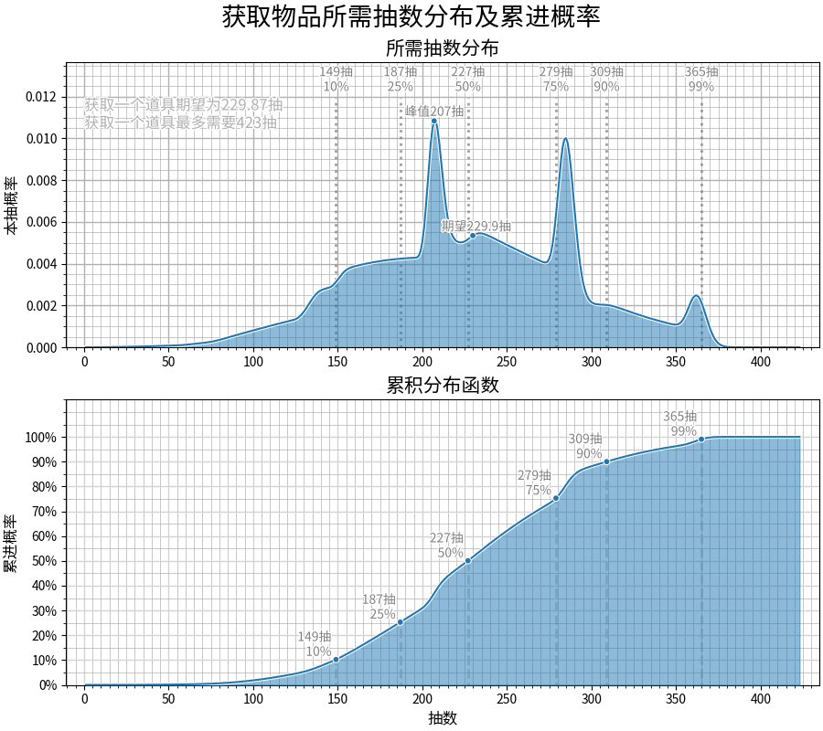

> 本文仅作经验分享用，不建议读者将之视为教程学习。  
> 本文依照我自身的认知而作，描述方面可能出现错漏，敬请见谅。  
> 感谢相关开发者对项目的贡献。  
> 项目地址：[https://github.com/OneBST/GGanalysis](https://github.com/OneBST/GGanalysis)  
> 文档地址：[https://onebst.github.io/GGanalysis](https://onebst.github.io/GGanalysis)

# 背景
随着星铁更新 2.0 版本，流萤圈粉无数，许多人也随之开始攒星琼。显然对于星铁这样的 GachaGame 来说，攒星琼意味着几乎不能获得新的角色，是很无聊的。此时群内自然发生了关于抽卡概率的讨论。因此昨天尝试了一下 GGanalysis 这个工具，感觉还是挺有趣的，在此分享使用经历。  

# 使用
>GGanalysis 是一个概率计算工具包，主要用于解决各类游戏抽卡概率计算问题。  

按照文档介绍，这个工具有相当多的功能，看起来也是相当复杂。它不仅可以计算诸如原神、崩坏：星穹铁道、重返未来1999等多种游戏的卡池概率，还可以根据自己的需求自定义抽卡概率模型。  
按照文档妥善安装库和相关字体后即可开始使用了。
## 已知目标 x+y 时，抽数概率分布的问题
以我为例，目前我在限定角色池垫了5抽，无大保底、在光锥池垫了12抽，有大保底；希望到流萤卡池能够得到 1+1 ，则代码如下  
```python
import GGanalysis.games.honkai_star_rail as SR
dist_c = SR.up_5star_character(item_num=2, item_pity=5, up_pity=0) * SR.up_5star_weapon(item_num=1, item_pity=12, up_pity=1)
import matplotlib.pyplot as plt
from GGanalysis.gacha_plot import DrawDistribution
fig = DrawDistribution(dist_c, show_description=True)
fig.show_two_graph(dpi=72)
plt.savefig('sr11.png')
```
把这段代码保存为一个py文件（值得注意的是，在不使用`__main__`的情况下不能够把他保存为诸如gi.py等有歧义的文件名）并运行，即可得到一张名为sr11的精美图片，上面给出了概率分布函数图像和概率密度函数图像：  



可见如果我想要有 90% 的把握拿下 1+1，则应该准备至少 309 抽。如果非常不幸，角色池两次都歪掉了，在不考虑提前金的情况下可能需要 360 抽才能够。当然，从表格上来看既没有提前金、又全都歪掉的概率并不高，仅有 3% 左右。  
另一个例子，如果两个池子都一抽也没垫，也都没有大保底，并且希望取得 2+1， 代码如下：    

```python
import GGanalysis.games.honkai_star_rail as SR
dist_c = SR.up_5star_character(item_num=3, item_pity=0, up_pity=0) * SR.up_5star_weapon(item_num=1, item_pity=0, up_pity=0)
import matplotlib.pyplot as plt
from GGanalysis.gacha_plot import DrawDistribution
fig = DrawDistribution(dist_c, show_description=True)
fig.show_two_graph(dpi=72)
plt.savefig('sr12.png')
```
同样的，运行之后会生成一张名为sr12的图片：  


可见在无垫无大保底的情况下要 90% 的把握拿下 2+1，至少应该准备 455 抽左右了。  
## 已有 k 抽，中奖数量概率分布的问题
对于上面提到的情况，显然并不是特别适合辛苦的低氪攒星琼玩家进行抽卡规划，而是更适合计算有明确目标时需要投入多少钱。对于贫穷的我来说，计算投入 k 抽后能抽到道具个数的分布更有实际意义。但到目前为止（2024/2/16），作者并没有给出完善的接口和文档，而是给出了示例程序并表示将会加入完善完善这个功能。  
仍以我的情况为例：我认为到卡池开放时我能够攒330抽左右，按照期望估计，在光锥池投入57抽后得到限定光锥，随后将剩余 273 抽全部投入角色池中。以此简单修改作者提供的程序可得：  
```python
import GGanalysis.games.honkai_star_rail as SR
import numpy as np
from GGanalysis import *

k = 273

distributions = SR.up_5star_character(8, multi_dist=True)

def calc_item_num_dist(dist_list: list[FiniteDist], pull):
    item_num = len(dist_list) - 1
    ans = np.zeros(item_num+1)
    for i in range(0, item_num+1):
        if len(dist_list[i]) <= pull+1:
            ans[i] = 1
        else:
            ans[i] = dist_list[i].cdf[pull]
    ans[0:-1] -= ans[1:].copy()
    return FiniteDist(ans)

item_num_dist = calc_item_num_dist(distributions, k)
from matplotlib import pyplot as plt
plt.fill_between(range(len(item_num_dist)), 0, item_num_dist[:], alpha=0.5, step='mid', edgecolor='none')
plt.step(range(len(item_num_dist)), item_num_dist[:], where='mid')
plt.savefig('kn1.png')
```

运行程序得到图片：
  
可见，我有极大的概率能够拿到 1 魂，和仅次于此的概率拿到 2 魂，虽然有些反直觉，但拿到 3 魂的概率实际高于仅拿到 0 魂的概率。总的来说，这也符合我的规划和预期。  
如果我在此基础上投入 1308 元，拿下全部首充双倍后，可以得到约 164 抽，若把这些继续投入角色池中，情况是这样的：  
  

我有最大的概率得到 3 魂，其次是较为接近的概率得到 4 魂和 2 魂，小于 10% 的概率得到 5 魂，和小于 5% 的概率得到 6 魂或 1 魂。  
当然我是没有钱这样做的，梦一直做.jpg。
# 写在最后
统计学工具可以让我们一定程度上预测自己的抽卡结果，但统计规律并不需要为个体现象负责，进行规划时还是要保守估计。  
除此之外，作为娱乐可以用这个工具来评估自己的运气如何。例如我在原神 4.3 雷神卡池中抽了 2+1 雷神，总共花费 297 抽，此时根据分布函数即可简单评估自己的运气：  
  

   
    
可见虽然没有很明显的提前金，但 297 抽约在 20% 的位置，应该说我的运气还是算是很不错的。  
那么就等到开流萤卡池之后再来继续评估我的运气了。